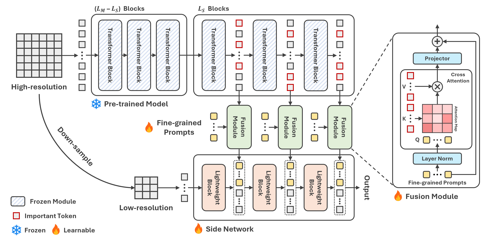

# FPT: PEFT for High-resolution Medical Image Classification

This is the pytorch implementation of the paper:

> Y. Huang, P. Cheng, R. Tam and X. Tang, "FPT: Fine-grained Prompt Tuning for Parameter and Memory Efficient Fine Tuning in High-resolution Medical Image Classification", under review, 2024. \[[arxiv](https://arxiv.org/abs/2403.07576)\]

We present Fine-grained Prompt Tuning (FPT), a novel PEFT method for medical image classification. FPT significantly reduces memory consumption compared to other PEFT methods, especially in high-resolution contexts. FPT achieves comparable performance to fine-tuning the entire LPM while using only 1.8% of the learnable parameters and 13% of the memory costs of an encoder ViT-B model with a 512x512 input resolution.



## Installation
To install the dependencies, run:
```shell
git clone https://github.com/YijinHuang/FPT.git
cd FPT
conda create -n fpt python=3.8
conda activate fpt
pip install -r requirements.txt
```


## Dataset
Four publicly accessible datasets are used in this work.

Evalutation:
- Messidor-2 (Fundus image) [[images](https://www.adcis.net/en/third-party/messidor2/)] [[labels](https://www.kaggle.com/datasets/google-brain/messidor2-dr-grades)].
- ISIC 2018 (Dermoscopic image) [[homepage](https://challenge.isic-archive.com/landing/2018/)].
- Mini-DDSM (Mammography) [[homepage](https://ardisdataset.github.io/MiniDDSM/?trk=public_profile_project-button)].
- COVID (Chest X-ray) [[homepage](https://www.kaggle.com/datasets/sid321axn/covid-cxr-image-dataset-research)].


## How to use
We use messidor-2 dataset as the example in the instruction.

**1. build your dataset:**

Organize messidor-2 as follows:

```
├── messidor2_dataset
    ├── train
        ├── class1
            ├── image1.jpg
            ├── image2.jpg
            ├── ...
        ├── class2
            ├── image3.jpg
            ├── image4.jpg
            ├── ...
        ├── class3
        ├── ...
    ├── val
    ├── test
```

Here, `val` and `test` directory have the same structure of  `train`.  Then replace the value of 'data_path' in BASIC_CONFIG in `configs/messidor2.yaml` with path to messidor2 dataset.

**2. Create or update a training configurations and hyperparameters in `configs/messidor2.yaml`.**

**3. Preloading (Optinal):**
```shell
$ python preload.py --config ./configs/messidor2.yaml --preload-path ./preload_features/messidor2
```

**4. Run to train:**

If preloading is enabled:
```shell
$ python main.py --config ./configs/messidor2.yaml --preload --preload-path ./preload_features/messidor2
```
else:
```shell
$ python main.py --config ./configs/messidor2.yaml
```


## Citation

If you find this repository useful, please cite the paper:
```
@article{huang2024fpt,
  title={FPT: Fine-grained Prompt Tuning for Parameter and Memory Efficient Fine Tuning in High-resolution Medical Image Classification},
  author={Huang, Yijin and Cheng, Pujin and Tam, Roger and Tang, Xiaoying},
  journal={arXiv preprint arXiv:2403.07576},
  year={2024}
}
```
